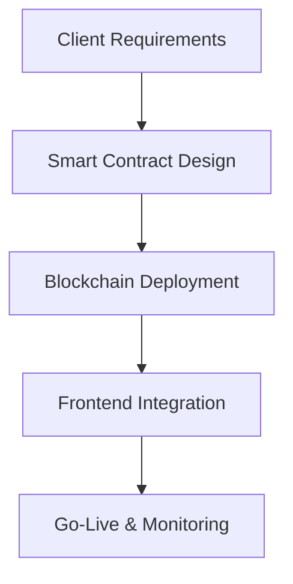

## Overview

Explore SotaTek's proven track record through real-world case studies. You discover how our expertise in software development, blockchain, and IT consulting drives client success. From scalable applications to secure blockchain platforms, these stories highlight measurable outcomes like reduced costs, faster time-to-market, and revenue growth.

<Callout kind="success">
SotaTek has delivered over 200 projects, achieving 95% client satisfaction and average 40% efficiency gains.
</Callout>

## Blockchain Project Implementations

SotaTek excels in blockchain solutions for finance and supply chain sectors. You benefit from our end-to-end implementations using Ethereum and Hyperledger.

<Columns cols={3}>
  <Card title="DeFi Platform" icon="database" href="#">
    Built a decentralized finance app handling `{>1000}` transactions per second, reducing fees by 60%.
  </Card>
  <Card title="NFT Marketplace" icon="zap" href="#">
    Developed secure NFT trading platform with smart contracts, generating `$5M` in first-year sales.
  </Card>
  <Card title="Supply Chain Tracker" icon="trending-up" href="#">
    Implemented traceable blockchain for logistics, cutting fraud by 80%.
  </Card>
</Columns>



## Software Development Case Examples

You access tailored software solutions that scale with your business. Review these examples across industries.

<Tabs>
  <Tab title="E-commerce Platform" icon="shopping-cart">
    Migrated legacy system to microservices architecture using Node.js and React.
    
    <CodeGroup tabs="Node.js,React">
    ````javascript
    // Backend API endpoint for orders
    app.post('/api/orders', async (req, res) => {
      const { items, userId } = req.body;
      const order = await createOrder({ items, userId });
      res.json({ orderId: order.id, status: 'confirmed' });
    });
    ````
    ````jsx
    // Frontend order submission
    const submitOrder = async (orderData) => {
      const response = await fetch('/api/orders', {
        method: 'POST',
        body: JSON.stringify(orderData),
      });
      const result = await response.json();
      console.log(`Order ${result.orderId} placed`);
    };
    ````
    </CodeGroup>
  </Tab>
  <Tab title="Healthcare App" icon="activity">
    Created HIPAA-compliant patient portal with real-time data sync.
  </Tab>
</Tabs>

## IT Consulting Transformations

Follow this step-by-step transformation for a retail client seeking digital agility.

<Steps>
  <Step title="Assessment" icon="search">
    Analyzed current IT infrastructure to identify bottlenecks.
  </Step>
  <Step title="Strategy Roadmap" icon="map">
    Designed cloud migration plan to AWS, projecting 50% cost savings.
  </Step>
  <Step title="Implementation" icon="code">
    Deployed CI/CD pipelines and containerized apps.
  </Step>
  <Step title="Optimization" icon="settings">
    Monitored performance, achieving `{<200ms}` response times.
  </Step>
</Steps>

<Expandable title="Detailed Metrics" default-open="true">
  Post-transformation: 70% faster deployments, 35% reduced operational costs.
</Expandable>

## Measurable Results and Testimonials

| Project Type | Key Metric | Client Outcome |
|--------------|------------|----------------|
| Blockchain | `{>500%}` ROI | Revenue doubled in 12 months |
| Software Dev | 45% speed improvement | User growth from 10K to 100K |
| IT Consulting | 60% cost reduction | Scaled to 5x traffic without downtime |

> "SotaTek transformed our supply chain with blockchain—reliable and innovative."  
> — CEO, Global Logistics Firm

<Callout kind="tip">
Contact us to discuss how similar successes apply to your business.
</Callout>